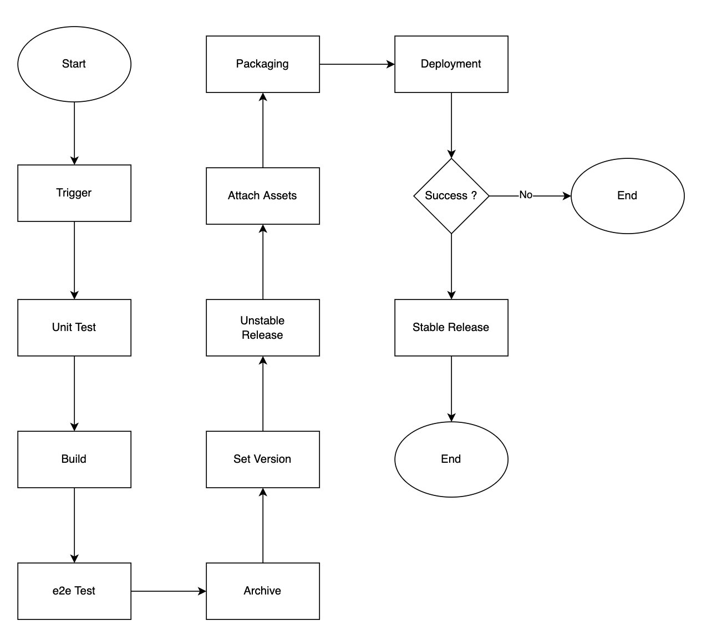

References
==========
- [Package From Github Action](https://snyk.io/blog/managing-node-js-docker-images-in-github-packages-using-github-actions/)
- [Semantic With Github Action](https://semantic-release.gitbook.io/semantic-release/recipes/ci-configurations/github-actions)
- [Semantic Github Action Example](https://svdoscience.com/2020-10-31/versioning-with-semantic-release)

Scenario
========

